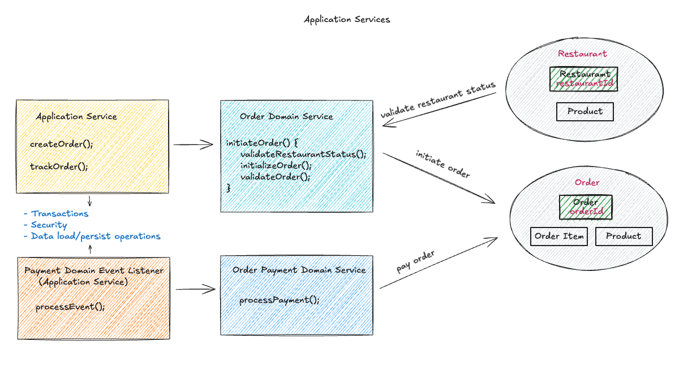
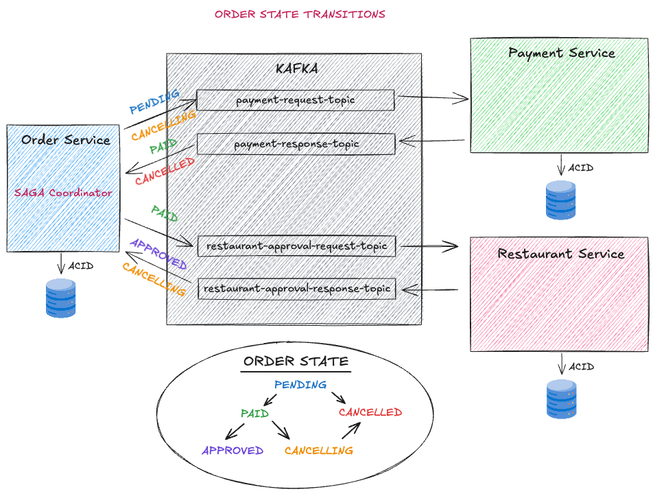
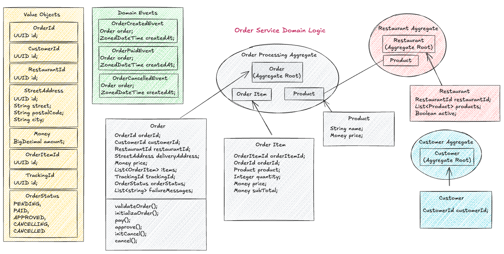

# food-ordering-system
Food ordering system application in Udemy course: Microservices: Clean Architecture, DDD, SAGA, Outbox &amp; Kafka

### Architecture

### Project Diagram

### Service Domain Diagram
